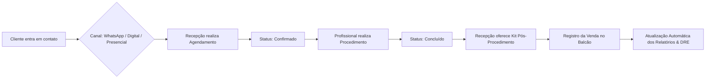
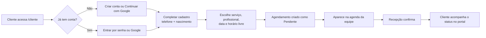
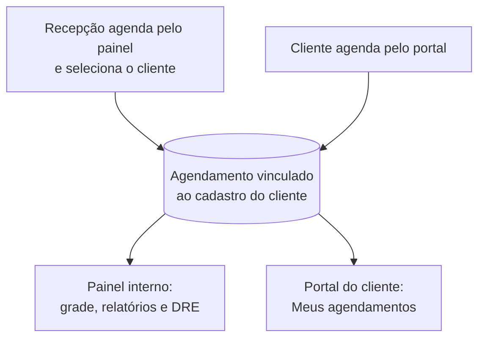

# 🌿 Agendamentos — Sistema Integrado de Gestão & Agendamentos

O **Agendamentos** é uma solução completa de gestão operacional e financeira projetada para clínicas de estética, consultórios de saúde e estabelecimentos de serviços com atendimento agendado. 

O sistema unifica em uma única plataforma a **agenda de atendimentos**, o **relacionamento com clientes**, o **controle de caixa e vendas de produtos**, a **gestão da equipe profissional** e **relatórios de inteligência de negócios**.

A plataforma tem **duas portas de entrada independentes**: o **painel interno** (`/dashboard`), usado pela equipe da clínica, e o **Portal do Cliente** (`/cliente`), onde a própria pessoa cria sua conta, agenda e acompanha seus atendimentos. Os dois enxergam **o mesmo cadastro e a mesma agenda** — um agendamento feito pela recepção aparece na hora no portal do cliente, e vice-versa.

---

## 🎯 Propósito & Objetivos do Sistema

O objetivo principal da plataforma é eliminar falhas na agenda, automatizar o fluxo de atendimento da recepção até a sala do profissional, otimizar a venda cruzada de produtos de skincare e pós-procedimento, e fornecer ao gestor uma visão analítica em tempo real da saúde financeira da clínica.

---

## 📋 Regras de Negócio & Funcionalidades

### 1. 📅 Gestão de Agenda & Atendimentos
- **Grade Horária Flexível**: Visualização em lista e em grade por profissional da equipe, respeitando o tempo de duração individual de cada procedimento (ex: Consulta Inicial 30min, Botox 45min, Harmonização 90min).
- **Ciclo de Vida do Agendamento**:
  - `Pendente`: Agendamento pré-reservado aguardando confirmação.
  - `Confirmado`: Cliente confirmou presença pelo canal de atendimento.
  - `Concluído`: Procedimento realizado com sucesso (alimenta automaticamente a receita e relatórios).
  - `Cancelado`: Horário liberado na grade para novos encaixes.
- **Canais de Origem (Captação)**: Todo agendamento é categorizado pela sua origem (`Digital`, `WhatsApp`, `Presencial` ou `Telefone`), permitindo medir o retorno dos canais de atendimento.
- **Controle de Bloqueio Retroativo**: Proteção contra alteração ou marcação de consultas em horários passados, garantindo a integridade dos dados históricos (recurso ajustável por administradores).

---

### 2. 👤 Relacionamento & Cadastro de Clientes
- **Prontuário Unificado**: Ficha completa do cliente contendo dados de contato, CPF, data de nascimento e cálculo automático de iniciais para identificação visual rápida.
- **Histórico Consolidado**: Visualização centralizada de todos os atendimentos passados do cliente, serviços realizados e produtos adquiridos no balcão.
- **Indicadores de Retenção**: Identificação de clientes recorrentes versus novos clientes para estratégias de fidelização.
- **Cadastro Único (Interno + Portal)**: O cliente cadastrado pela recepção é **o mesmo registro** que ele acessa no portal. Quando a pessoa cria sua conta com um e-mail já cadastrado pela clínica, o sistema **assume a ficha existente** em vez de criar uma segunda — preservando todo o histórico de atendimentos.

---

### 3. 🛍️ Vendas de Produtos & Checkout de Balcão
- **Catálogo de Produtos**: Controle de itens comercializados (ex: Séruns, Protetores Solares, Kits Pós-Procedimento, Sabonetes Faciais) categorizados e precificados.
- **Venda Cruzada Pós-Atendimento**: Permite que a recepção ou o próprio profissional registrem a venda de produtos recomendados logo após a conclusão do procedimento.
- **Formas de Pagamento & Caixas**: Suporte a múltiplos métodos de pagamento (`Pix`, `Cartão de Crédito`, `Cartão de Débito` e `Dinheiro`), com cálculo de ticket médio e totalização por período.
- **Controle de Estoque**: Baixa e acompanhamento de quantidades disponíveis em estoque.

---

### 4. 👥 Gestão de Equipe & Controle de Acesso
- **Perfis de Acesso Granulares**:
  - `Administrador`: Acesso total a todas as configurações, trava de agenda, gerenciamento de equipe e DRE.
  - `Gestor`: Acesso completo aos relatórios de faturamento, vendas e dashboards operacionais.
  - `Esteticista / Profissional`: Foco na visualização e execução da própria agenda de atendimentos.
  - `Funcionário / Recepção`: Acesso ao agendamento de consultas, cadastro de clientes e checkout de vendas.
- **Permissões Customizáveis**: Controle dinâmico de permissões especiais (como `ver_relatorios` e `compartilhar_permissoes`).
- **Segurança de Acesso**: Bloqueio temporário de segurança após múltiplas tentativas inválidas de login para proteção dos dados da clínica.

---

### 5. 📈 Inteligência Analítica & Relatórios (DRE)
- **Faturamento e Receita em Tempo Real**: Métricas atualizadas automaticamente de faturamento total, ticket médio e volume de procedimentos executados.
- **Mapa de Calor de Ocupação Semanal**: Gráfico intuitivo mostrando os dias e horários de maior e menor movimento na clínica, orientando campanhas de promoção para horários ociosos.
- **Ranking de Serviços & Produtos**: Identificação dos procedimentos mais procurados e dos produtos mais vendidos.
- **Produtividade da Equipe**: Análise individual da carga de trabalho e faturamento gerado por cada profissional da clínica.

---

### 6. 🙋 Portal do Cliente (Autoatendimento)

Área pública em `/cliente`, com identidade visual própria e **totalmente isolada** do sistema interno. O cliente entra sozinho, agenda sozinho e acompanha seus horários sem depender da recepção.

#### Conta e Login Próprios
- **Login independente da equipe**: O portal tem sessão própria, separada da sessão do painel interno. Uma credencial de cliente **nunca** abre o sistema da clínica, e uma credencial da equipe não vale como sessão de cliente.
- **Duas formas de entrar, uma única conta**:
  - **E-mail e senha** — cadastro direto no portal (`/cliente/cadastro`).
  - **Continuar com Google** — login social, sem precisar criar senha.
- **Vínculo automático pelo e-mail verificado**: Se a pessoa já tem conta por senha e depois entra pelo Google (ou o contrário), o sistema reconhece que é **a mesma pessoa** e vincula as duas formas de acesso à mesma ficha. Nada de cliente duplicado, nada de histórico perdido.
- **Definir senha depois**: Quem entrou pelo Google (ou foi cadastrado pela clínica) recebe no portal um convite para criar uma senha, passando a ter as duas formas de entrar.
- **Completar cadastro obrigatório**: Telefone e data de nascimento não vêm do Google. Enquanto faltarem, o portal fica **travado** numa tela de conclusão — sem agendar e sem navegar. A trava é validada no servidor, não só na tela.

#### O que o cliente faz sozinho
- **Agendar** (`/cliente/agendar`): fluxo guiado de **serviço → profissional → data → horário → confirmação**, com apenas os horários realmente livres.
- **Acompanhar** (`/cliente/meus-agendamentos`): próximos atendimentos e histórico, com detalhes de serviço, duração, profissional e status.
- **Cancelar**: o próprio cliente cancela atendimentos futuros, liberando o horário na grade da clínica na hora.
- **Sair**: encerramento de sessão pelo próprio portal.

#### Agenda compartilhada nos dois sentidos
Painel interno e portal leem **a mesma agenda**. Quando a recepção cria um agendamento em `/agenda` e seleciona o cliente na lista, aquele atendimento passa a aparecer em "Meus agendamentos" do portal daquela pessoa — sem sincronização, sem espera, porque é o mesmo registro.

- **Agendou pelo painel** → cliente vê no portal, com serviço, data, horário e profissional.
- **Agendou pelo portal** → entra na grade da equipe como `Pendente`, marcado como origem digital, aguardando confirmação da clínica.

> O atendimento só aparece no portal se estiver vinculado a um cliente cadastrado. Agendamentos avulsos, criados sem selecionar alguém da lista, ficam só na agenda interna.

#### Segurança e Privacidade do Portal
- **Preços nunca chegam ao cliente**: o catálogo enviado ao portal carrega nome, descrição e duração — **valores não saem do servidor**, nem escondidos na tela.
- **Posse verificada no servidor**: toda consulta filtra pelo cliente autenticado. Tentar abrir o agendamento de outra pessoa resulta em "não encontrado", não em vazamento.
- **Identidade vem da sessão**: o cliente do agendamento é lido da sessão, nunca de um campo enviado pelo navegador.
- **Sem escalada de privilégio**: entrar pelo Google jamais concede cargo interno. Se o e-mail pertencer a um usuário da equipe, o acesso pelo portal é recusado e o cargo permanece intocado.
- **Contas inativas continuam bloqueadas**: nem o login social contorna uma conta desativada.
- **Nada de administrativo é alcançável**: dashboard, relatórios, DRE, vendas, estoque, equipe, permissões e configurações ficam fora do alcance do portal.

---

## 💡 Fluxos Operacionais no Dia a Dia



### Autoatendimento pelo Portal do Cliente



### A mesma agenda, vista dos dois lados



---

## 🧪 Ambiente de Demonstração & Apresentação a Clientes

Para apresentações comerciais e validação do sistema, o projeto conta com um gerador de dados realistas cobrindo os **últimos 3 meses** de operação de uma clínica ativa:

- **50 Clientes cadastrados** com nomes e contatos brasileiros realistas.
- **250+ Agendamentos** distribuídos com horários de pico, durações reais e status atualizados.
- **260+ Vendas de produtos** registradas com diferentes métodos de pagamento (Pix, Cartão, Dinheiro).
- **8 Serviços e 7 Produtos** no catálogo com movimentação e relatórios completos.

### Credenciais Padrão de Acesso (Demonstração):

**Painel interno** — [http://localhost:3000/login](http://localhost:3000/login)
- **Administrador**: `admin@agendamentos.com` | **Senha**: `zxcasd`
- **Profissional / Gabriel**: `gabriel@agendamentos.com` | **Senha**: `lkjh-poiu-zxc10`

**Portal do cliente** — [http://localhost:3000/cliente/login](http://localhost:3000/cliente/login)

Os clientes gerados pelo seed existem como ficha na clínica, mas ainda **sem senha de portal** — é assim que o cliente cadastrado pela recepção nasce. Para demonstrar o autoatendimento, crie a conta em `/cliente/cadastro` usando o **mesmo e-mail e telefone** de um cliente do seed: o sistema reconhece a ficha existente e a pessoa entra já com todo o histórico de atendimentos dela.

### Roteiro sugerido para apresentação

1. No painel interno, em **Agenda**, crie um atendimento e selecione um cliente da lista.
2. Abra `/cliente/cadastro` (aba anônima) e crie a conta com o e-mail e telefone daquele cliente.
3. O portal pede a **data de nascimento** para concluir o cadastro — os clientes do seed não têm esse campo.
4. Em **Meus agendamentos**, o atendimento que a recepção acabou de criar já está lá, com todo o histórico anterior.
5. Pelo portal, agende um novo horário — ele aparece na grade da equipe como `Pendente`.
6. De volta ao painel, confirme o atendimento e veja o status mudar no portal.

---

## 🚀 Instalação Rápida

### 1. Clonar e Instalar Dependências
```bash
git clone https://github.com/GTavaresDev/agendamentos.git
cd agendamentos
npm install
```

### 2. Iniciar Banco de Dados Local (Docker) & Gerar Dados de Teste
```bash
docker compose up -d
npx prisma migrate dev
npm run db:seed
```

### 3. Variáveis de Ambiente
Copie `.env.example` para `.env` e preencha os valores. Nenhum segredo fica no
código — a aplicação lê tudo do ambiente.

```bash
cp .env.example .env
npx auth secret   # gera AUTH_SECRET, se você ainda não tiver um
```

`AUTH_GOOGLE_ID` e `AUTH_GOOGLE_SECRET` são obtidos no Google Cloud (seção
abaixo). Sem eles, o portal continua funcionando com e-mail/senha — só o botão
"Continuar com Google" fica indisponível.

> `.env` e `.env.local` são ignorados pelo Git. Só `.env.example` é versionado,
> e ele contém apenas placeholders vazios.

### 4. Iniciar a Aplicação
```bash
npm run dev
```
Acesse [http://localhost:3000](http://localhost:3000) no seu navegador.

---

## 🔐 Login com Google no Portal do Cliente

O portal do cliente (`/cliente`) aceita **e-mail/senha e Google** como duas
portas para a **mesma conta**. O vínculo é feito pelo e-mail verificado do
Google: quem já é cliente entra na conta que já tem, com o mesmo histórico de
agendamentos — nunca é criado um segundo cadastro. O login social **não**
concede nenhum acesso ao sistema interno.

> Esta seção cobre só a configuração das credenciais. As regras de negócio do
> portal estão em [Portal do Cliente (Autoatendimento)](#6--portal-do-cliente-autoatendimento).

### Configurar as credenciais no Google Cloud

1. **Criar o projeto** — acesse o [Google Cloud Console](https://console.cloud.google.com/),
   clique no seletor de projetos e em **New project**. Dê um nome (ex.:
   `agendamentos-portal`) e crie.

2. **Configurar a tela de consentimento** — em **APIs & Services → OAuth consent
   screen**, escolha **External**, preencha nome do app, e-mail de suporte e
   e-mail do desenvolvedor. Em **Scopes**, mantenha apenas `email`, `profile` e
   `openid`. Enquanto o app estiver em **Testing**, adicione em **Test users**
   os e-mails que poderão entrar; publique o app quando for para produção.

3. **Criar as credenciais** — em **APIs & Services → Credentials**, clique em
   **Create credentials → OAuth client ID** e escolha **Web application**.

4. **Authorized JavaScript origins** — informe a origem da aplicação, sem path:

   | Ambiente | Origem |
   |---|---|
   | Desenvolvimento | `http://localhost:3000` |
   | Produção | `https://SEU-DOMINIO.com` |

5. **Authorized redirect URIs** — informe a rota de callback do portal. Ela é
   diferente da rota da equipe (`/api/auth/...`):

   | Ambiente | Redirect URI |
   |---|---|
   | Desenvolvimento | `http://localhost:3000/api/cliente/auth/callback/google` |
   | Produção | `https://SEU-DOMINIO.com/api/cliente/auth/callback/google` |

   Cadastre as duas se você usa os dois ambientes. `localhost` **nunca** deve
   ser a URL de produção.

6. **Copiar o Client ID** — após salvar, o Google mostra o **Client ID** (algo
   como `<numero>-<hash>.apps.googleusercontent.com`).

7. **Copiar o Client Secret** — na mesma tela, copie o **Client secret**. Ele é
   exibido integralmente só na criação; guarde em local seguro.

8. **Preencher o ambiente** — coloque os valores no `.env` (nunca no
   `.env.example`, nunca no código):

   ```dotenv
   AUTH_GOOGLE_ID=<seu client id>
   AUTH_GOOGLE_SECRET=<seu client secret>
   AUTH_SECRET=<segredo do Auth.js>
   ```

   Reinicie `npm run dev` depois de alterar o `.env`.

> `AUTH_GOOGLE_SECRET` e `AUTH_SECRET` são **server-side**. Não use prefixo
> `NEXT_PUBLIC_`, não passe por props/Client Components e não imprima em log —
> há um teste automatizado (`src/lib/env-security.test.ts`) que falha se isso
> acontecer.

---

## ⚙️ Tecnologias Principais (Resumo)

- **Front-end / Framework**: Next.js 16 (App Router), React 19, Tailwind CSS v4, Lucide Icons, Recharts.
- **Back-end & Banco de Dados**: Node.js, Prisma ORM v6, PostgreSQL 16, NextAuth.js v5.
- **Autenticação**: duas sessões independentes — equipe e Portal do Cliente — com cookies e chaves de assinatura distintas. O portal aceita senha (bcrypt) e Google OAuth.
- **Arquitetura**: domínio e casos de uso isolados em `core/` (regras de negócio testadas sem banco nem framework), interface e Server Actions em `src/`.

---

## 📄 Licença

Este projeto é de propriedade privada. Todos os direitos reservados.
