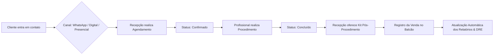

# 🌿 Agendamentos — Sistema Integrado de Gestão & Agendamentos

O **Agendamentos** é uma solução completa de gestão operacional e financeira projetada para clínicas de estética, consultórios de saúde e estabelecimentos de serviços com atendimento agendado. 

O sistema unifica em uma única plataforma a **agenda de atendimentos**, o **relacionamento com clientes**, o **controle de caixa e vendas de produtos**, a **gestão da equipe profissional** e **relatórios de inteligência de negócios**.

---

## 🎯 Propósito & Objetivos do Sistema

O objetivo principal da plataforma é eliminar falhas na agenda, automatizar o fluxo de atendimento da recepção até a sala do profissional, otimizar a venda cruzada de produtos de skincare e pós-procedimento, e fornecer ao gestor uma visão analítica em tempo real da saúde financeira da clínica.

---

## 📋 Regras de Negócio & Funcionalidades

### 1. 📅 Gestão de Agenda & Atendimentos
- **Grade Horária Flexível**: Visualização em lista e em grade por profissional da equipe, respeitando o tempo de duração individual de cada procedimento (ex: Consulta Inicial 30min, Botox 45min, Harmonização 90min).
- **Ciclo de Vida do Agendamento**:
  - `Pendente`: Agendamento pré-reservado aguardando confirmação.
  - `Confirmado`: Cliente confirmou presença pelo canal de atendimento.
  - `Concluído`: Procedimento realizado com sucesso (alimenta automaticamente a receita e relatórios).
  - `Cancelado`: Horário liberado na grade para novos encaixes.
- **Canais de Origem (Captação)**: Todo agendamento é categorizado pela sua origem (`Digital`, `WhatsApp`, `Presencial` ou `Telefone`), permitindo medir o retorno dos canais de atendimento.
- **Controle de Bloqueio Retroativo**: Proteção contra alteração ou marcação de consultas em horários passados, garantindo a integridade dos dados históricos (recurso ajustável por administradores).

---

### 2. 👤 Relacionamento & Cadastro de Clientes
- **Prontuário Unificado**: Ficha completa do cliente contendo dados de contato, CPF, data de nascimento e cálculo automático de iniciais para identificação visual rápida.
- **Histórico Consolidado**: Visualização centralizada de todos os atendimentos passados do cliente, serviços realizados e produtos adquiridos no balcão.
- **Indicadores de Retenção**: Identificação de clientes recorrentes versus novos clientes para estratégias de fidelização.

---

### 3. 🛍️ Vendas de Produtos & Checkout de Balcão
- **Catálogo de Produtos**: Controle de itens comercializados (ex: Séruns, Protetores Solares, Kits Pós-Procedimento, Sabonetes Faciais) categorizados e precificados.
- **Venda Cruzada Pós-Atendimento**: Permite que a recepção ou o próprio profissional registrem a venda de produtos recomendados logo após a conclusão do procedimento.
- **Formas de Pagamento & Caixas**: Suporte a múltiplos métodos de pagamento (`Pix`, `Cartão de Crédito`, `Cartão de Débito` e `Dinheiro`), com cálculo de ticket médio e totalização por período.
- **Controle de Estoque**: Baixa e acompanhamento de quantidades disponíveis em estoque.

---

### 4. 👥 Gestão de Equipe & Controle de Acesso
- **Perfis de Acesso Granulares**:
  - `Administrador`: Acesso total a todas as configurações, trava de agenda, gerenciamento de equipe e DRE.
  - `Gestor`: Acesso completo aos relatórios de faturamento, vendas e dashboards operacionais.
  - `Esteticista / Profissional`: Foco na visualização e execução da própria agenda de atendimentos.
  - `Funcionário / Recepção`: Acesso ao agendamento de consultas, cadastro de clientes e checkout de vendas.
- **Permissões Customizáveis**: Controle dinâmico de permissões especiais (como `ver_relatorios` e `compartilhar_permissoes`).
- **Segurança de Acesso**: Bloqueio temporário de segurança após múltiplas tentativas inválidas de login para proteção dos dados da clínica.

---

### 5. 📈 Inteligência Analítica & Relatórios (DRE)
- **Faturamento e Receita em Tempo Real**: Métricas atualizadas automaticamente de faturamento total, ticket médio e volume de procedimentos executados.
- **Mapa de Calor de Ocupação Semanal**: Gráfico intuitivo mostrando os dias e horários de maior e menor movimento na clínica, orientando campanhas de promoção para horários ociosos.
- **Ranking de Serviços & Produtos**: Identificação dos procedimentos mais procurados e dos produtos mais vendidos.
- **Produtividade da Equipe**: Análise individual da carga de trabalho e faturamento gerado por cada profissional da clínica.

---

## 💡 Fluxos Operacionais no Dia a Dia



---

## 🧪 Ambiente de Demonstração & Apresentação a Clientes

Para apresentações comerciais e validação do sistema, o projeto conta com um gerador de dados realistas cobrindo os **últimos 3 meses** de operação de uma clínica ativa:

- **50 Clientes cadastrados** com nomes e contatos brasileiros realistas.
- **250+ Agendamentos** distribuídos com horários de pico, durações reais e status atualizados.
- **260+ Vendas de produtos** registradas com diferentes métodos de pagamento (Pix, Cartão, Dinheiro).
- **8 Serviços e 7 Produtos** no catálogo com movimentação e relatórios completos.

### Credenciais Padrão de Acesso (Demonstração):
- **Administrador**: `admin@agendamentos.com` | **Senha**: `zxcasd`
- **Profissional / Gabriel**: `gabriel@agendamentos.com` | **Senha**: `lkjh-poiu-zxc10`

---

## 🚀 Instalação Rápida

### 1. Clonar e Instalar Dependências
```bash
git clone https://github.com/GTavaresDev/agendamentos.git
cd agendamentos
npm install
```

### 2. Iniciar Banco de Dados Local (Docker) & Gerar Dados de Teste
```bash
docker compose up -d
npx prisma migrate dev
npm run db:seed
```

### 3. Iniciar a Aplicação
```bash
npm run dev
```
Acesse [http://localhost:3000](http://localhost:3000) no seu navegador.

---

## ⚙️ Tecnologias Principais (Resumo)

- **Front-end / Framework**: Next.js 16 (App Router), React 19, Tailwind CSS v4, Lucide Icons, Recharts.
- **Back-end & Banco de Dados**: Node.js, Prisma ORM v6, PostgreSQL 16, NextAuth.js v5.

---

## 📄 Licença

Este projeto é de propriedade privada. Todos os direitos reservados.
